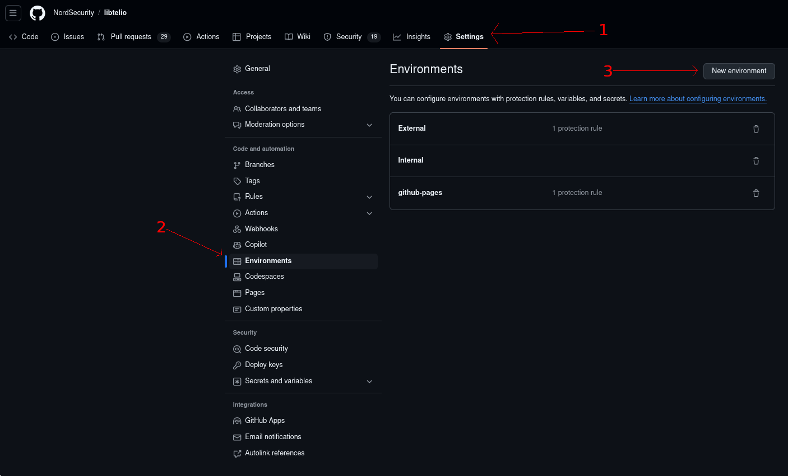
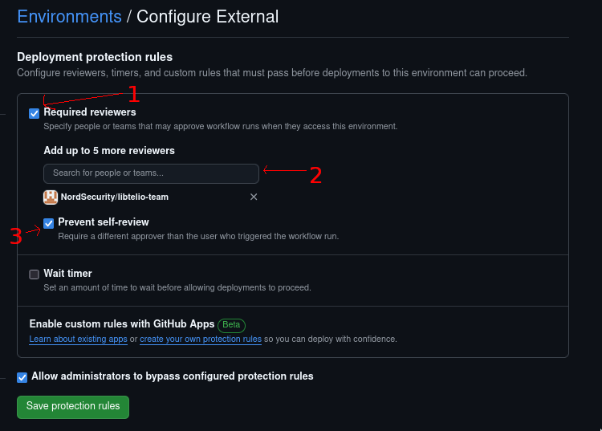

# Trigger GitLab pipeline action

This action triggers a pipeline for a specified project and ref at a specified GitLab instance.

## Required Secrets

### `ci-api-v4-url`

**Required** The root URL of the GitLab instance v4 API.

### `access-token`

**Required** A project access token (PAT) with Maintainer API access for the GitLab project.

Instructions on creating access tokens: https://docs.gitlab.com/ee/user/project/settings/project_access_tokens.html#create-a-project-access-token

### `trigger-token`

**Required** A pipeline trigger token (PTT) for the GitLab project.

Instructions on creating trigger tokens: https://docs.gitlab.com/ee/ci/triggers/#create-a-trigger-token

### `project-id`

**Required** The ID of the project for which a pipeline shall be started.

## Inputs

### `triggered-ref`

**Required** The ref of the project for which a pipeline shall be started.

### `schedule`

**Optional** **[Default: false]** An indication if it is an automatically scheduled request.

### `cancel-outdated-pipelines`

**Optional** **[Default: true]** If set to true, it will cancel previous pipelines that are running for the same reference.

## Outputs

None.

## Usage

In order to make use of this triggering workflow, there are two steps:
1. Setup deployment environments
2. Call the workflow

### Setting up the deployment environments
In order to correctly use this triggering workflow - one is required to create deployment environments called `External` and `Internal` for their project.
`External` environment corresponds for contributions from 3rd-party companies or developers.
This deployment environment should have protection rules configured to provide a limited list of github users who an approve the workflow run.

`Internal` environment represents contributions from internal members of the organization. Therefore no additional environment protection rules are required.

In order to setup these environments, go to your project `settings`, then `Environments`.
Click on the button called "New environment", and name the first environment `Internal`, later repeat the process, for the environment called `External`.




Later select the `External` environment, and mark the tick box called `Required reviewers`.
In the list of reviewers - add the usernames of github accounts for who should have workflow approving rights.
It is common to add project-owning team to this list. Then, for good measure, select "prevent self-review".




### Calling the workflow

In order to call this workflow, assuming secrets are stored as github secrets with the capitalized names - specify the following job in your workflow:

```yaml
jobs:
  trigger-gitlab-pipeline:
    uses: NordSecurity/trigger-gitlab-pipeline/.github/workflows/trigger-gitlab-pipeline.yml@<git sha of this repository>
    secrets:
      ci-api-v4-url: ${{ secrets.CI_API_V4_URL }}
      access-token: ${{ secrets.GITLAB_API_TOKEN }}
      trigger-token: ${{ secrets.TOKEN }}
      project-id: ${{ secrets.PROJECT_ID }}
    with:
      schedule: ${{ github.event_name == 'schedule' }}
      cancel-outdated-pipelines: ${{ github.ref_name != 'main' }}
      triggered-ref: <reference in the gitlab project to trigger>

```

# Developement
## Linters
This project uses ESLint to lint the code. To run it locally install dev dependencies once with:
```
$npm install
```
and run eslint with:
```
$npx eslint ./index.js
```
## Updating node_modules
Because this repository is a nodejs github action it should have node_modules that are needed to run the action committed into the repository.
To not bloat the repository unnecessarily please only commit production dependencies.
In order to install only production dependencies please run this before committing node_modules:
```
$npm install --omit=dev
```
